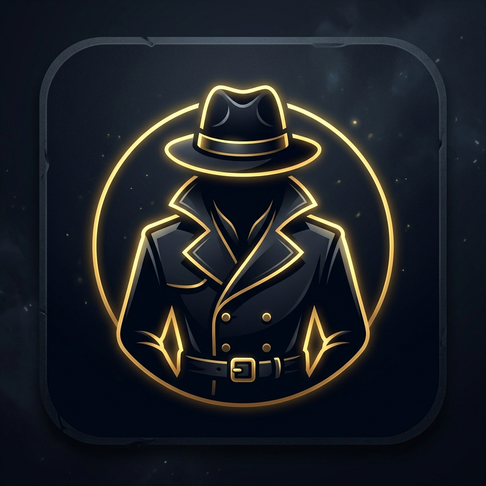

<p align="center">
  
</p>

# Memory Detective

Memory Detective is a professional Flutter Android app designed as an offline brain-training game. It features a complete suite of memory mini-games with a sleek spy agency aesthetic. The app utilizes Riverpod for state management, Hive for offline local storage, and Google Mobile Ads (AdMob) for monetization.

## Project Structure

```text
memory-detective/
+-- android/             # Native Android build files
+-- build/               # Generated build outputs
+-- lib/                 # Main Flutter source code
|   +-- ads/             # AdMob configuration and service
|   +-- core/            # Audio manager and routing
|   +-- data/            # Hive local storage adapters
|   +-- game/            # Core game logic and scene data
|   +-- models/          # Data models (PlayerStats, etc.)
|   +-- providers/       # Riverpod state providers
|   +-- screens/         # UI screens (Home, Minigames, Cases)
|   +-- theme/           # App colors and styling
|   +-- widgets/         # Reusable UI components
+-- test/                # Unit and widget tests
+-- pubspec.yaml         # Project dependencies
+-- README.md            # This file
```

## Included Features

* **Number Memory Game**: Remember and type back increasingly long sequences of numbers.
* **Sequence Memory Game**: Memorize the pattern of glowing buttons in a "Simon Says" style challenge.
* **Sound Memory Game**: Listen to audio clues and match the exact sequence of sounds.
* **Visual Memory Game**: Memorize the positions of highlighted tiles on a dynamic grid.
* **Evidence Board**: Track your overall brain-training progress and statistics.
* **Offline Play**: 100% playable without an internet connection using local Hive storage.

## Run Locally

**Configure the Flutter App:**

Make sure you have Flutter and Android Studio installed on your system.

```bash
flutter pub get
flutter run
```

## Test the Game

1. Start the Flutter app using `flutter run` or an IDE like Android Studio / VS Code.
2. The game will launch into the main menu.
3. Tap **"Start Training"** to access the 4 mini-games.
4. Play a few rounds to ensure local storage saves your high scores properly.
5. Tap the **Briefcase / Profile icon** to view your saved stats on the Evidence Board.

## AdMob Configuration

Ads are fully integrated but set to "Test Mode" during local development.

The app includes an adaptive banner on the home screen, a conservatively paced interstitial after every three solved cases, and Google's UMP consent flow. Android release builds automatically use the configured live banner and interstitial IDs. Debug builds always use Google's official test IDs to keep development traffic policy-safe. 

**Override test IDs at build time:**
```bash
flutter run \
  --dart-define=ADMOB_ANDROID_BANNER_ID=your-banner-id \
  --dart-define=ADMOB_ANDROID_INTERSTITIAL_ID=your-interstitial-id
```

Before publishing, ensure your real AdMob application ID is set in your `android/app/src/main/AndroidManifest.xml` file.

## Build APK or AAB for Google Play

Create a release keystore (`key.jks`) and add `android/key.properties` with your signing credentials. A template is available if needed.

```properties
storePassword=your-store-password
keyPassword=your-key-password
keyAlias=your-key-alias
storeFile=C:\\absolute\\path\\to\\your-release.jks
```

**For testing APK:**
```bash
flutter build apk --release
```

**For Play Store AAB:**
```bash
flutter build appbundle --release
```

**Important before publishing:**
* Configure real release signing in `android/key.properties`.
* Ensure you are not tracking/committing `key.properties` to GitHub.
* Replace test AdMob app IDs with production IDs.
* Update package name, version code, and app icons.
* Run `flutter build appbundle` and upload the generated `.aab` file.

## Future Features

The code is structured cleanly with Riverpod so future minigames can be added easily:

* **Word Memory Challenge**
* **Symbol Matching**
* **Multiplayer Leaderboards**
* **Cloud Save Sync**
